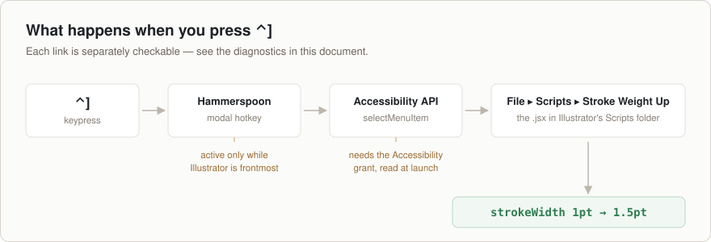

# Binding the scripts to a keyboard shortcut

Illustrator does not list scripts in its Keyboard Shortcuts dialog, so the
binding is attached from outside, to the menu item each script adds under
**File → Scripts**.

Two ways to do that. Hammerspoon gives you any key combination and is the one
these instructions are built around; the Actions panel needs nothing extra but
only accepts function keys.

## Hammerspoon — any key combination

Hammerspoon watches for the keypress and asks Illustrator to run the menu item
through the Accessibility API.



### 1. Install Hammerspoon

```bash
brew install --cask hammerspoon
```

If that stops with `a password is required`, your account is not in the admin
group — common on managed Macs. Install into your home folder instead, which
needs no admin rights and works identically:

```bash
brew install --cask --appdir="$HOME/Applications" hammerspoon
```

### 2. Install the config

```bash
./scripts/install-hammerspoon.sh
```

This copies `integrations/hammerspoon/stroke-increment.lua` into
`~/.hammerspoon/` and adds a `require` line to `init.lua`, backing up any
existing one. Safe to re-run.

### 3. Grant Accessibility

Open Hammerspoon and approve the prompt, or go to System Settings → Privacy &
Security → Accessibility and enable Hammerspoon.

> **Then restart Hammerspoon** — restart, not reload. The permission is read
> once at launch, so a running Hammerspoon carries on believing it has none.
> This is the most common reason the keys do nothing.

### 4. Use it

Select something with a stroke and press `⌃]`.

| Shortcut | Does |
| --- | --- |
| `⌃]` | Up one rung |
| `⌃[` | Down one rung |
| `⌃⇧]` | Up three rungs |
| `⌃⇧[` | Down three rungs |

Hold a key to ramp continuously.

### Why Control

Illustrator's shipped shortcut set uses only Shift, Command and Option — Control
appears nowhere in it, so the whole `⌃` space is free and these four collide
with nothing. Command is avoided deliberately: `⌘[` and `⌘]` are Send Backward
and Send Forward.

### Changing the keys

Edit the `M.bindings` table at the top of `~/.hammerspoon/stroke-increment.lua`,
then reload from the Hammerspoon menu bar icon.

### Two details in how it is written

**The bindings are scoped to Illustrator.** Hammerspoon hotkeys are global, so
they live in a modal that an application watcher enters and exits. They exist
only while Illustrator is frontmost, and `⌃]` stays free everywhere else.

**Repeats are throttled.** An Accessibility menu call is not instant, while key
auto-repeat is, so repeats closer together than `M.minInterval` (60 ms) are
dropped — otherwise the events queue and the weight keeps climbing after you
release. Raise it if the ramp overshoots, lower it for a faster ramp, or set
`M.keyRepeat = false` for one step per press.

## Actions panel — no dependencies, function keys only

Illustrator restricts action shortcuts to `F1`–`F12` plus Shift and/or Command.
Per script:

1. **Window → Actions**
2. New set (folder icon), name it `Stroke Increment`
3. New action (`+`), name it `Stroke Weight Up`, pick a **Function Key**, **Record**
4. Immediately press **Stop** — there is nothing to record
5. With the action selected: panel menu (☰) → **Insert Menu Item…**
6. Choose **File → Scripts → Stroke Weight Up**, then OK

Suggested: `F5`/`F6` for down/up, `⇧F5`/`⇧F6` for the large steps. Save the set
from the panel menu so it survives a preferences reset.

On a Mac laptop, enable **Use F1, F2, etc. as standard function keys** in System
Settings → Keyboard, or you will have to hold `fn`.

## When the keys do nothing

Add `require("hs.ipc")` to the top of `~/.hammerspoon/init.lua` and the `hs` CLI
can interrogate the running config. Each check isolates one hop in the diagram
above — work down the list, and the first failure is your answer.

```bash
# 1. Accessibility. Read once at launch, so after granting it you must RESTART
#    Hammerspoon, not just reload the config. Most failures are here.
hs -c 'return tostring(hs.accessibilityState())'

# 2. Did the module load, or is there a Lua error?
hs -c 'local ok, m = pcall(require, "stroke-increment")
       return ok and (#m.bindings .. " bindings") or ("ERROR: " .. tostring(m))'

# 3. Can Hammerspoon see the menu item? findMenuItem only looks, it does not
#    click, so this is safe to run over live artwork.
hs -c 'local a = hs.application.get("com.adobe.illustrator")
       return tostring(a:findMenuItem({"File","Scripts","Stroke Weight Up"}) ~= nil)'

# 4. Is the modal scoped correctly? Expect 0 with Illustrator in the background
#    and 4 with it frontmost.
hs -c 'local n = 0
       for _, hk in ipairs(hs.hotkey.getHotkeys()) do
         if hk.msg and (hk.msg:find("%[") or hk.msg:find("%]")) then n = n + 1 end
       end
       return hs.application.frontmostApplication():name() .. ": " .. n'
```

Also worth checking:

- **The scripts are not in File → Scripts.** Illustrator scans that folder only
  at launch — restart it. If they are still missing, re-run
  `./scripts/install.sh`; an Illustrator update clears the folder.
- **Check 3 fails though the menu item is visibly there.** The name must match
  exactly, without `.jsx`. Look for a trailing space.
- **A managed Mac refuses the Accessibility grant.** MDM can restrict which apps
  receive Accessibility. If the toggle will not stick, ask IT to allow
  Hammerspoon, or use the Actions panel route, which needs no permission.
